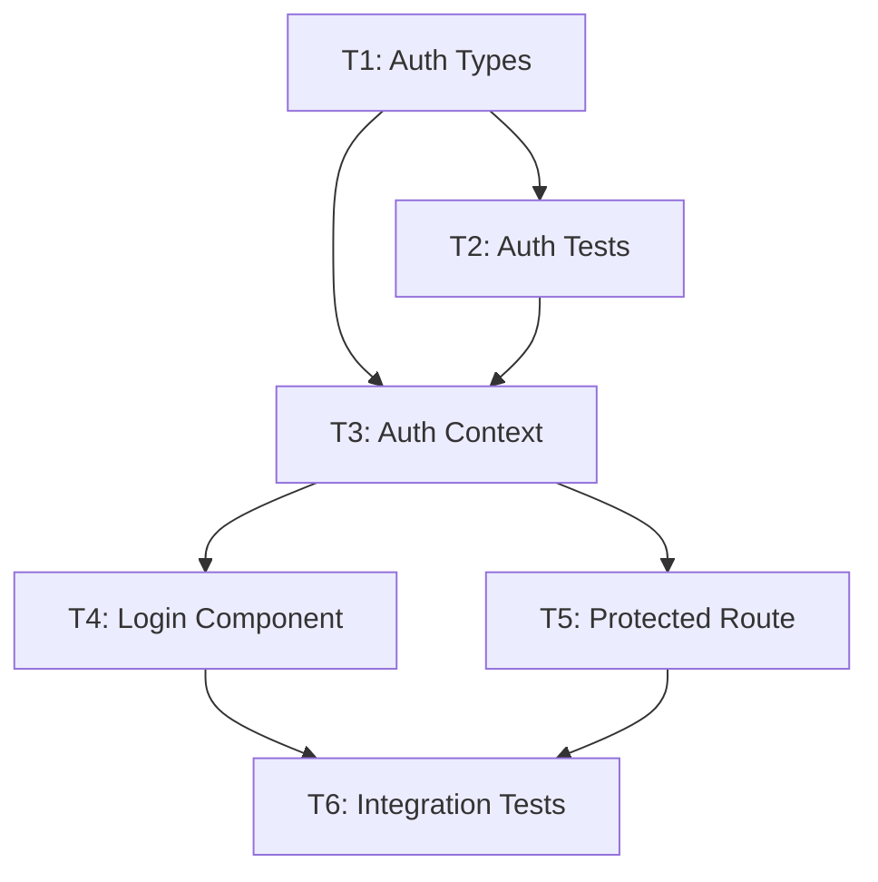

# /decompose - Transform Blueprint into Task Contracts

## Invocation
```
/decompose [blueprint-path]
```

Default: `./WEAVER_BLUEPRINT.md`

## Purpose

Transform a WEAVER_BLUEPRINT.md into an executable `tasks.json` contract. This contract defines atomic, context-scoped tasks that sub-agents can complete autonomously within a single loop.

---

## Processing Pipeline

### Step 1: Blueprint Validation

Before decomposition, verify the blueprint is ready:

```bash
# Check blueprint exists
test -f ./WEAVER_BLUEPRINT.md || echo "ERROR: Blueprint not found"

# Check for unresolved questions
grep -c "Status.*OPEN" ./WEAVER_BLUEPRINT.md
# If > 0, abort: "Cannot decompose: X open questions remain"

# Check for approval
grep -q "Approved by.*___" ./WEAVER_BLUEPRINT.md && echo "WARNING: Blueprint not yet approved"
```

### Step 2: Extract Tasks from Blueprint

Parse each "Task N:" section and extract:
- Task name and description
- Target files (with action: CREATE/MODIFY)
- Constraints
- Success markers
- Dependencies

### Step 3: Apply Atomicity Rules

**CRITICAL**: Each task must be completable in ONE autonomous agent loop.

#### Atomicity Constraints

| Metric | Limit | Action if Exceeded |
|--------|-------|-------------------|
| Files changed | ≤ 5 | Split into sub-tasks |
| Lines of code | ≤ 300 | Split into sub-tasks |
| Distinct concerns | ≤ 1 | Split by concern |
| External dependencies | ≤ 1 new | Separate dependency task |

#### Splitting Strategy

When a task exceeds limits:

```
Original Task: "Implement authentication system"
  Files: 8 files

Split Into:
  Task 1.1: "Create auth types and interfaces" (2 files)
  Task 1.2: "Implement auth context provider" (2 files)
  Task 1.3: "Create login component" (2 files)
  Task 1.4: "Create protected route wrapper" (2 files)

Dependencies: 1.2 depends on 1.1, 1.3 depends on 1.2, 1.4 depends on 1.2
```

### Step 4: Define Context Scopes

**CRITICAL**: Sub-agents operate in a ~200k token window. Minimize context to prevent "Agent Fatigue" (degraded performance from context overload).

#### Context Scoping Rules

For each task, define `required_context` containing ONLY:

1. **Direct targets**: Files being modified
2. **Interface dependencies**: Files that define types/interfaces used
3. **Pattern exemplars**: 1-2 files showing the pattern to follow
4. **Test utilities**: If writing tests, include test helpers

#### Context Budget

| Context Type | Max Files | Max Lines |
|--------------|-----------|-----------|
| Direct targets | 5 | 500 |
| Dependencies | 3 | 300 |
| Exemplars | 2 | 200 |
| Test utilities | 1 | 100 |
| **Total** | **11** | **1100** |

If a task requires more context, it's too complex—split it.

### Step 5: Attach Validation Commands

**RULE**: Every task MUST have automated validation.

#### Validation Hierarchy

```
1. Existing test suite    → npm run test -- --grep "auth"
2. Type checking          → npm run typecheck
3. Linting               → npm run lint -- --fix-dry-run
4. Build verification    → npm run build
5. Custom script         → node scripts/verify-task.js
```

#### No Test Exists?

If no automated test covers the task's functionality:

```json
{
  "id": "T1.0",
  "name": "Write tests for auth middleware",
  "type": "test-first",
  "description": "Create test file before implementation",
  "target_files": ["src/middleware/auth.test.ts"],
  "validation_command": "npm run test -- src/middleware/auth.test.ts",
  "expected_validation": "Test suite runs (tests will fail until T1.1 completes)"
}
```

The implementation task then depends on this test task.

---

## tasks.json Schema

```json
{
  "$schema": "./task-schema.json",
  "version": "1.0",
  "blueprint_source": "./WEAVER_BLUEPRINT.md",
  "generated_at": "2024-01-15T10:30:00Z",
  "thread_id": "uuid-from-weaver-state",

  "metadata": {
    "total_tasks": 8,
    "estimated_agent_loops": 8,
    "critical_path": ["T1", "T2", "T4", "T6", "T8"],
    "parallelizable_groups": [
      ["T3", "T5"],
      ["T7"]
    ]
  },

  "tasks": [
    {
      "id": "T1",
      "name": "Create auth types and interfaces",
      "type": "implementation",
      "description": "Define TypeScript interfaces for authentication flow",
      "priority": 1,

      "atomicity": {
        "file_count": 2,
        "estimated_lines": 80,
        "concerns": ["type-definitions"],
        "within_limits": true
      },

      "target_files": [
        {
          "path": "src/types/auth.ts",
          "action": "CREATE",
          "purpose": "Auth type definitions"
        },
        {
          "path": "src/types/index.ts",
          "action": "MODIFY",
          "purpose": "Export new auth types"
        }
      ],

      "required_context": {
        "direct_targets": [
          "src/types/auth.ts",
          "src/types/index.ts"
        ],
        "dependencies": [
          "src/types/user.ts"
        ],
        "exemplars": [
          {
            "path": "src/types/api.ts",
            "reason": "Shows existing type definition patterns"
          }
        ],
        "test_utilities": [],
        "total_files": 4,
        "estimated_tokens": 2500
      },

      "constraints": [
        {
          "rule": "Follow existing type naming convention",
          "source": "src/types/api.ts",
          "example": "interface ApiResponse<T> { data: T; error?: string; }"
        },
        {
          "rule": "Export all types from index.ts",
          "source": "src/types/index.ts",
          "example": "export * from './auth';"
        }
      ],

      "validation": {
        "command": "npm run typecheck",
        "expected_outcome": "Type checking passes with no errors",
        "timeout_seconds": 60,
        "retry_on_failure": false
      },

      "success_markers": [
        {
          "type": "file_exists",
          "path": "src/types/auth.ts"
        },
        {
          "type": "exports_exist",
          "file": "src/types/index.ts",
          "exports": ["AuthUser", "AuthToken", "AuthState"]
        },
        {
          "type": "command_succeeds",
          "command": "npm run typecheck"
        }
      ],

      "dependencies": {
        "depends_on": [],
        "blocks": ["T2", "T3"]
      },

      "agent_assignment": {
        "type": "implementer",
        "capabilities_required": ["typescript", "type-definitions"]
      },

      "rollback": {
        "strategy": "delete_created_files",
        "files_to_remove": ["src/types/auth.ts"],
        "files_to_restore": ["src/types/index.ts"]
      }
    },

    {
      "id": "T2",
      "name": "Write auth context tests",
      "type": "test-first",
      "description": "Create failing tests for auth context before implementation",
      "priority": 2,

      "atomicity": {
        "file_count": 1,
        "estimated_lines": 120,
        "concerns": ["testing"],
        "within_limits": true
      },

      "target_files": [
        {
          "path": "src/context/AuthContext.test.tsx",
          "action": "CREATE",
          "purpose": "Test suite for auth context"
        }
      ],

      "required_context": {
        "direct_targets": [
          "src/context/AuthContext.test.tsx"
        ],
        "dependencies": [
          "src/types/auth.ts"
        ],
        "exemplars": [
          {
            "path": "src/context/ThemeContext.test.tsx",
            "reason": "Shows existing context testing pattern"
          }
        ],
        "test_utilities": [
          "src/test/test-utils.tsx"
        ],
        "total_files": 4,
        "estimated_tokens": 3200
      },

      "constraints": [
        {
          "rule": "Use existing test utilities",
          "source": "src/test/test-utils.tsx",
          "example": "import { renderWithProviders } from '@/test/test-utils';"
        },
        {
          "rule": "Follow AAA pattern (Arrange-Act-Assert)",
          "source": "src/context/ThemeContext.test.tsx",
          "example": "// Arrange\\nconst { getByRole } = render(...)\\n// Act\\nfireEvent.click(...)\\n// Assert\\nexpect(...)"
        }
      ],

      "validation": {
        "command": "npm run test -- src/context/AuthContext.test.tsx --passWithNoTests",
        "expected_outcome": "Test file is valid and runnable (tests may fail pending implementation)",
        "timeout_seconds": 120,
        "retry_on_failure": false
      },

      "success_markers": [
        {
          "type": "file_exists",
          "path": "src/context/AuthContext.test.tsx"
        },
        {
          "type": "command_succeeds",
          "command": "npm run test -- src/context/AuthContext.test.tsx --passWithNoTests"
        }
      ],

      "dependencies": {
        "depends_on": ["T1"],
        "blocks": ["T3"]
      },

      "agent_assignment": {
        "type": "implementer",
        "capabilities_required": ["testing", "react-testing-library"]
      },

      "rollback": {
        "strategy": "delete_created_files",
        "files_to_remove": ["src/context/AuthContext.test.tsx"],
        "files_to_restore": []
      }
    }
  ],

  "validation_summary": {
    "all_tasks_have_validation": true,
    "test_first_tasks": ["T2", "T5"],
    "validation_commands": [
      "npm run typecheck",
      "npm run test -- src/context/AuthContext.test.tsx",
      "npm run test -- src/middleware/auth.test.ts",
      "npm run build"
    ]
  },

  "execution_plan": {
    "phases": [
      {
        "phase": 1,
        "name": "Foundation",
        "tasks": ["T1"],
        "parallel": false
      },
      {
        "phase": 2,
        "name": "Test Scaffolding",
        "tasks": ["T2", "T5"],
        "parallel": true
      },
      {
        "phase": 3,
        "name": "Implementation",
        "tasks": ["T3", "T4", "T6"],
        "parallel": false
      },
      {
        "phase": 4,
        "name": "Integration",
        "tasks": ["T7", "T8"],
        "parallel": false
      }
    ],
    "estimated_total_loops": 8,
    "checkpoint_after": ["T1", "T3", "T6", "T8"]
  }
}
```

---

## Decomposition Algorithm

```
FUNCTION decompose(blueprint):
    tasks = []

    FOR each task_section in blueprint.tasks:
        raw_task = parse_task_section(task_section)

        # Step 1: Check atomicity
        IF raw_task.file_count > 5 OR raw_task.line_estimate > 300:
            sub_tasks = split_by_concern(raw_task)
            FOR sub_task in sub_tasks:
                sub_task = apply_atomicity_constraints(sub_task)
                tasks.append(sub_task)
        ELSE:
            tasks.append(raw_task)

    # Step 2: Ensure test coverage
    FOR task in tasks:
        IF task.type == "implementation":
            IF NOT has_existing_test(task):
                test_task = create_test_first_task(task)
                test_task.id = task.id + ".0"  # Test comes before impl
                task.depends_on.append(test_task.id)
                tasks.insert_before(task, test_task)

    # Step 3: Scope context
    FOR task in tasks:
        task.required_context = calculate_minimal_context(task)
        IF task.required_context.estimated_tokens > 50000:
            WARN("Task context too large, consider splitting")

    # Step 4: Build dependency graph
    dependency_graph = build_graph(tasks)
    execution_plan = topological_sort(dependency_graph)
    identify_parallel_groups(execution_plan)

    # Step 5: Validate all tasks have validation
    FOR task in tasks:
        IF NOT task.validation_command:
            ERROR("Task {task.id} missing validation command")

    RETURN TaskContract(tasks, execution_plan)
```

---

## Context Calculation

```
FUNCTION calculate_minimal_context(task):
    context = {
        direct_targets: [],
        dependencies: [],
        exemplars: [],
        test_utilities: []
    }

    # Always include target files
    FOR file in task.target_files:
        context.direct_targets.append(file.path)

    # Find type/interface dependencies
    FOR file in task.target_files:
        imports = analyze_required_imports(file, task.constraints)
        FOR imp in imports:
            IF imp.is_local AND imp NOT IN context.direct_targets:
                context.dependencies.append(imp.path)

    # Include pattern exemplars from constraints
    FOR constraint in task.constraints:
        IF constraint.source NOT IN context.direct_targets:
            context.exemplars.append({
                path: constraint.source,
                reason: constraint.rule
            })

    # If test task, include test utilities
    IF task.type IN ["test-first", "test"]:
        test_utils = find_test_utilities()
        context.test_utilities = test_utils[:1]  # Max 1

    # Calculate token estimate
    context.estimated_tokens = estimate_tokens(context)

    # Enforce limits
    context = enforce_context_limits(context)

    RETURN context


FUNCTION enforce_context_limits(context):
    # Priority: targets > dependencies > exemplars > utilities

    IF len(context.dependencies) > 3:
        context.dependencies = prioritize(context.dependencies)[:3]

    IF len(context.exemplars) > 2:
        context.exemplars = prioritize(context.exemplars)[:2]

    IF context.estimated_tokens > 50000:
        # Remove least critical items until under limit
        WHILE context.estimated_tokens > 50000:
            remove_lowest_priority_item(context)

    RETURN context
```

---

## Validation Command Generation

```
FUNCTION generate_validation_command(task):
    # Priority 1: Existing specific test
    test_file = find_test_for_files(task.target_files)
    IF test_file:
        RETURN "npm run test -- {test_file}"

    # Priority 2: Type checking (for type-related tasks)
    IF task.concerns.includes("types"):
        RETURN "npm run typecheck"

    # Priority 3: Lint check
    IF task.type == "implementation":
        files = join(task.target_files, " ")
        RETURN "npm run lint -- {files}"

    # Priority 4: Build verification
    IF task.affects_exports:
        RETURN "npm run build"

    # Priority 5: Custom verification script
    RETURN "node scripts/verify-task.js --task={task.id}"
```

---

## Output

### Primary Output
```
./tasks.json                 # Executable task contract
```

### Supplementary Outputs
```
./tasks.lock                 # Hash of blueprint + tasks for change detection
./task-graph.mmd            # Mermaid diagram of task dependencies
```

### Example task-graph.mmd


---

## Error Handling

| Error | Cause | Resolution |
|-------|-------|------------|
| `BLUEPRINT_NOT_FOUND` | Missing WEAVER_BLUEPRINT.md | Run `/draft-prd` first |
| `OPEN_QUESTIONS` | Unresolved questions in blueprint | Resolve questions before decompose |
| `ATOMICITY_VIOLATION` | Task too large after splitting | Manual intervention required |
| `CONTEXT_OVERFLOW` | Cannot reduce context below limit | Split task further |
| `NO_VALIDATION_POSSIBLE` | Cannot determine any validation | Add `validation_command` manually |
| `CIRCULAR_DEPENDENCY` | Tasks have circular deps | Restructure task breakdown |

---

## Command Options

```bash
/decompose                           # Process ./WEAVER_BLUEPRINT.md
/decompose path/to/blueprint.md      # Process specific blueprint
/decompose --dry-run                 # Show decomposition without writing
/decompose --validate-only           # Check existing tasks.json is valid
/decompose --regenerate              # Force regenerate even if tasks.json exists
/decompose --visualize               # Output task-graph.mmd only
```
